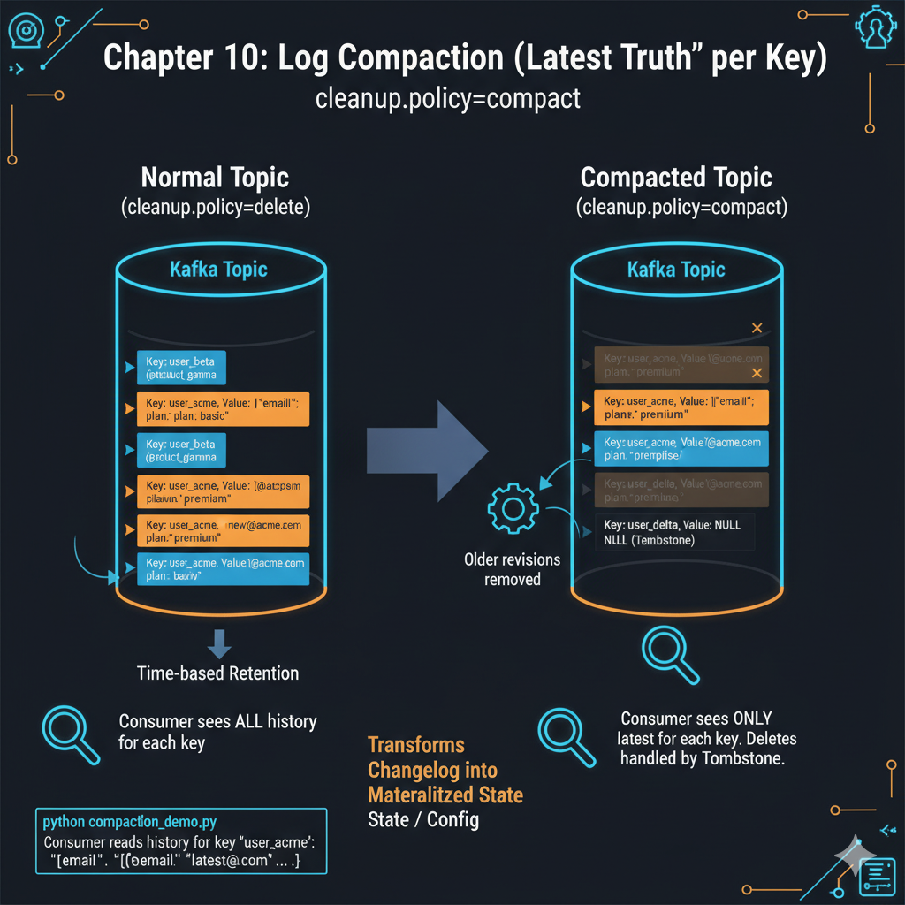

# Chapter 10: Log Compaction (“Latest Truth” per Key)



Normal topics keep an append-only log until retention deletes old segments.

**Compaction** changes the semantics: Kafka keeps **at least** the latest value for **each key** (plus tombstones when you delete a key). That turns a changelog topic into something like a **materialized map** keyed by record key — useful for **config/state** that updates over time.

This chapter uses **`cleanup.policy=compact`** on a small topic.

## Prerequisites

Docker, Python 3, `kafka-python`.

## Quick start

```bash
cd chapter_10_compaction
docker compose up -d
```

Then:

```bash
pip install -r requirements.txt
python compaction_demo.py
```

## How it works

This script demonstrates a production-grade way of sending data to Kafka. Instead of sending raw JSON or strings, it uses Avro (a binary format) and a Schema Registry.

Here is the step-by-step breakdown of what is happening:

1. Defining the "Contract" (Avro Schema)
The SCHEMA_STR defines exactly what a message must look like.

It must be a record named UserProfile.

It must have two fields: name (string) and department (string).

Why? This prevents "garbage" data from entering Kafka. If you try to send a user without a department, the producer will throw an error before the message ever leaves your script.

2. Connecting to the "Brain" (Schema Registry)
code
Python
registry = SchemaRegistryClient({"url": SR_URL})
The Schema Registry is a separate service (usually running on port 8081). It acts as a librarian.

It stores the schema.

It gives the schema a unique ID.

It allows consumers to look up the schema later so they know how to read the binary data.

3. Setting up the Serializers
code
Python
avro_serializer = AvroSerializer(registry, SCHEMA_STR, user_as_record)
The AvroSerializer does two things:

Registration: When you run the script, it sends the SCHEMA_STR to the Schema Registry. The Registry says, "Okay, this is Schema #1."

Conversion: It takes your Python dictionary (e.g., {"name": "Ada", ...}) and converts it into a very small, efficient binary format.

4. The "Wire Format" (The Secret Sauce)
When producer.produce() is called, the data sent to Kafka isn't just the Avro bytes. The Confluent library prepends a 5-byte header:

Byte 0: Magic Byte (always 0).

Bytes 1-4: The Schema ID from the Registry (e.g., ID 0001).

Rest of the message: The actual Avro-encoded data.

This is why it's better than JSON: The message doesn't need to include the field names ("name", "department") over and over again. It only sends the values and the ID, making the messages much smaller.

5. The Production Loop
code
Python
for body in payloads:
    producer.produce(
        topic=TOPIC,
        key=str(body["name"]).lower(), # Key is a string (e.g., "ada")
        value=body,                    # Value is the dict, which gets Avro-serialized
        on_delivery=delivery_report,
    )
Key: It uses the user's name as the Kafka key. This ensures all updates for "Ada" go to the same partition (important for the log compaction you saw in Chapter 10).

Value: It sends the Python dictionary. The SerializingProducer automatically calls the AvroSerializer to turn that dict into those special 5-byte-header Avro bytes.

on_delivery: A callback that tells you if Kafka actually received the message or if it failed.

6. Finalizing
producer.flush(): This is critical. Kafka producers "batch" messages to be fast. flush() forces the producer to send any messages remaining in the local queue before the script exits.

Summary: What you see in Kafka
If you used a basic Kafka tool to look at the registered_users topic, the data would look like unreadable gibberish because it is binary.

To read it, you would need a "Console Consumer" that also connects to the Schema Registry, sees "ID #1" in the message header, downloads the schema, and uses it to decode the binary back into human-readable text.

You will produce several updates under the **same key** (`user_acme`) and read from `earliest` to see history. Background **log cleaner** jobs eventually discard older versions for each key according to broker/topic cleaner settings (timing varies).

If you recreated the broker but the topic already existed **without** compact config, wipe volumes:

```bash
docker compose down -v && docker compose up -d
```

## Files

| File | Role |
|------|------|
| `docker-compose.yml` | Broker with log cleaner enabled |
| `compaction_demo.py` | Creates compact topic config, produces keyed updates, reads history |

## Cleanup

```bash
docker compose down -v
```
